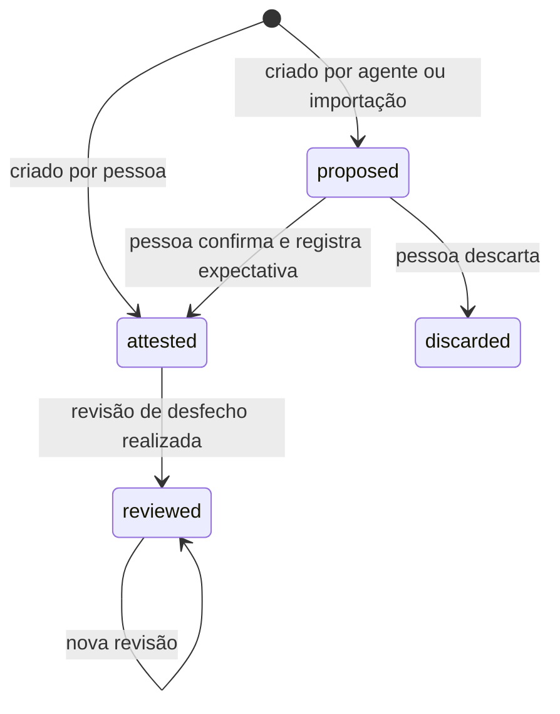

# Superfície MCP

A interface primária do registro é um servidor MCP. Racional em [ADR 0002](docs/adr/0002-mcp-first.md).

São oito ferramentas, e não haverá uma nona sem ADR. As duas últimas, `get_topic_timeline` e `find_related`, entraram pelo [ADR 0006](docs/adr/0006-linha-do-tempo-e-relacionadas.md). A descrição de cada uma é parte do produto: é ela que faz o agente chamar a ferramenta no momento certo, sem ser pedido. Por isso as descrições abaixo são escritas como **gatilho** ("chame quando…"), não como manual.

## Regras que valem para todas

1. **Nenhuma ferramenta escreve expectativa.** Confiança e resultado esperado são digitados por pessoa, numa superfície humana (Slack ou web), no momento da atestação. Não existe parâmetro para isso em nenhuma ferramenta, e isso é deliberado: uma confiança estimada por agente transforma a curva de calibração em ruído.
2. **Todo registro criado por agente nasce `proposed`.** Só vira `attested` quando uma pessoa o confirma, fora do MCP.
3. **Toda escrita registra procedência**: `author_kind = agent`, o modelo, a pessoa em nome de quem o agente agiu (identidade do OAuth) e uma referência de origem, quando o cliente a fornecer.
4. **Toda resposta carrega o bloco `pending`** (formato abaixo). É o lembrete embutido que puxa o loop de revisão para dentro do fluxo de trabalho.
5. **Somente leitura sobre fontes externas.** Nenhuma ferramenta aciona GrowthBook, ABsmartly ou qualquer outra plataforma. O agente pode compor com os servidores MCP delas; este servidor não.

## Ferramentas

### `search_evidence`

> Chame ANTES de redigir proposta, PRD, plano de experimento ou qualquer recomendação de produto, para saber o que a organização já testou, decidiu ou aprendeu sobre o tema. Chame também sempre que alguém perguntar "já testamos isso?" ou "por que decidimos X?". Retorna evidências, lições e decisões, com a força de cada evidência.

| Parâmetro | Tipo | Obrigatório | Nota |
| --- | --- | --- | --- |
| `query` | string | sim | Texto livre |
| `tags` | string[] | não | Filtra pela taxonomia compartilhada |
| `kinds` | enum[] | não | `experiment`, `study`, `analysis`, `document`, `external` |
| `source_system` | string | não | Ex.: `growthbook`, `internal.lab` |
| `include` | enum[] | não | `evidence`, `learning`, `decision`; padrão: os três |
| `limit` | int | não | Padrão 10, máximo 50 |

Retorna `items[]` com `type`, `id`, `title`, `summary`, `strength`, `source`, `tags` e `state`. Lições e decisões em estado `proposed` aparecem marcadas como tal.

Anotações: `readOnlyHint: true`, `idempotentHint: true`, `openWorldHint: false`.

### `get_decision`

> Chame quando precisar do raciocínio completo por trás de uma decisão específica: contexto, alternativas descartadas e por quê, evidências que sustentaram ou contradisseram, lições derivadas e revisões realizadas.

| Parâmetro | Tipo | Obrigatório |
| --- | --- | --- |
| `id` ou `slug` | string | um dos dois |

Retorna a decisão com `alternatives[]`, `evidence[]` (com `role` e `weight` da relação), `learnings[]`, `reviews[]`, `state` e `provenance`. A expectativa é incluída apenas se a decisão estiver atestada.

Anotações: `readOnlyHint: true`, `idempotentHint: true`, `openWorldHint: false`.

### `propose_decision`

> Chame quando uma escolha de produto for fechada na conversa — "vamos com a opção B", "decidimos não lançar", "mantemos o fluxo atual" — para que ela entre no registro com contexto e alternativas enquanto o raciocínio ainda está fresco. O registro nasce como proposta e será confirmado por uma pessoa.

| Parâmetro | Tipo | Obrigatório | Nota |
| --- | --- | --- | --- |
| `title` | string | sim | Frase afirmativa: "Remover etapa de confirmação do checkout" |
| `description` | string | sim | O que foi decidido |
| `context` | string | não | O problema, em até três frases |
| `decider_email` | string | sim | Quem decidiu; não necessariamente quem conversa com o agente |
| `decided_on` | date | não | Padrão: hoje |
| `door` | enum | não | `one_way` ou `two_way`; padrão `two_way` |
| `project` | string | não | Nome ou id |
| `alternatives` | object[] | não | `{description, rejection_reason}`; ambos obrigatórios por item |
| `tags` | string[] | não | |
| `evidence` | object[] | não | `{evidence_id, role}`; atalho para `attach_evidence` |
| `idempotency_key` | string | não | Reenvio com a mesma chave devolve o registro existente |

Retorna `decision_id`, `slug`, `state: "proposed"`, `attest_url` e `missing[]` — os campos que, se preenchidos, tornariam o registro útil (tipicamente `alternatives` e `evidence`).

Anotações: `readOnlyHint: false`, `destructiveHint: false`, `idempotentHint: true` (com `idempotency_key`), `openWorldHint: false`.

### `attach_evidence`

> Chame quando uma evidência — resultado de experimento, estudo, análise, entrevista ou documento — tiver pesado numa decisão, seja a favor ou contra. Registre também a evidência que contradisse a escolha: evidência contrária registrada é o que distingue memória de justificativa.

| Parâmetro | Tipo | Obrigatório | Nota |
| --- | --- | --- | --- |
| `decision_id` | string | sim | |
| `evidence_id` | string | um dos dois | Evidência já existente |
| `evidence` | object | um dos dois | Nova: `{kind, title, summary?, url?, source_system?, external_id?, strength}` |
| `role` | enum | sim | `supports`, `contradicts`, `discarded` |
| `weight` | number | não | 0 a 1 |
| `note` | string | não | Como a evidência foi usada |

Uma evidência nova com `source_system` + `external_id` já existentes é reaproveitada, não duplicada.

Anotações: `readOnlyHint: false`, `destructiveHint: false`, `idempotentHint: true`, `openWorldHint: false`.

### `record_learning`

> Chame quando um experimento terminar, uma decisão for revisada ou alguém formular uma conclusão que valha para além do caso atual — "usuários preferem X quando Y". Escreva a lição como afirmação reutilizável, não como resumo do caso.

| Parâmetro | Tipo | Obrigatório | Nota |
| --- | --- | --- | --- |
| `summary` | string | sim | A afirmação, em linguagem de negócio |
| `decision_ids` | string[] | um dos dois | Origem |
| `evidence_ids` | string[] | um dos dois | Origem |
| `tags` | string[] | não | |

Retorna `learning_id` e `state: "proposed"`.

Anotações: `readOnlyHint: false`, `destructiveHint: false`, `idempotentHint: false`, `openWorldHint: false`.

### `list_pending_reviews`

> Chame no início de uma sessão de planejamento, ao retomar um projeto ou quando alguém perguntar o que está pendente: lista decisões cuja revisão de desfecho venceu ou está próxima, e registros propostos aguardando atestação.

| Parâmetro | Tipo | Obrigatório | Nota |
| --- | --- | --- | --- |
| `owner_email` | string | não | Padrão: a pessoa autenticada |
| `project` | string | não | |
| `overdue_only` | boolean | não | Padrão `false` |
| `include_unattested` | boolean | não | Padrão `true` |

Anotações: `readOnlyHint: true`, `idempotentHint: true`, `openWorldHint: false`.

### `get_topic_timeline`

> Chame quando a pergunta for sobre a trajetória de um tema, e não só sobre o que se sabe dele — "já mudamos de ideia sobre isso?", "o que veio antes desta decisão?", "como chegamos ao fluxo atual?" — e antes de propor reverter ou retomar algo que já foi decidido. Retorna, em ordem cronológica, as decisões sobre o tema, as revisões de desfecho e as lições registradas.

| Parâmetro | Tipo | Obrigatório | Nota |
| --- | --- | --- | --- |
| `query` | string | sim | Texto livre, com a mesma regra de relevância de `search_evidence` |
| `tags` | string[] | não | Filtra pela taxonomia compartilhada |
| `limit` | int | não | Quantas decisões e lições entram; padrão 20, máximo 50 |

Retorna `events[]` em ordem cronológica. Cada evento tem `on` (data), `type` (`decision`, `review` ou `learning`), `id`, `title`, `decision_id` e `tags`. Decisão traz também `slug`, `state`, `door` e `project`. Revisão traz `verdict` e `notes`, e só entra se já tiver sido realizada. Lição traz `state`. Os outros campos são `total`, com as decisões e lições que casaram antes do `limit`, e `note`, quando nada casa.

A seleção é por relevância, a ordem é por data. Nenhum evento traz confiança ou expectativa, nem de decisão atestada, e evidência não é evento: a data dela é da origem ou da carga, não da mudança de posição ([ADR 0006](docs/adr/0006-linha-do-tempo-e-relacionadas.md)).

Anotações: `readOnlyHint: true`, `idempotentHint: true`, `openWorldHint: false`.

### `find_related`

> Chame antes de rever, reverter ou contrariar uma decisão, ou quando alguém perguntar o que mais depende dela: lista as outras decisões ligadas a ela por evidência em comum — com o papel que a evidência teve em cada uma —, por lição em comum ou por tag. É o que mostra quem mais se apoiou nas mesmas premissas.

| Parâmetro | Tipo | Obrigatório | Nota |
| --- | --- | --- | --- |
| `id` ou `slug` | string | um dos dois | A decisão de partida |
| `limit` | int | não | Padrão 10, máximo 30 |

Retorna `decision_id`, `slug` e `title` da decisão de partida e `related[]`. Cada item de `related[]` traz `decision_id`, `slug`, `title`, `decided_on`, `state`, `project`, `shared_evidence[]` (`evidence_id`, `title`, `role_here`, `role_there`), `shared_learnings[]` (`learning_id`, `summary`) e `shared_tags[]`. Também vêm `total` e `note`, quando nada se relaciona.

A ordem é pela quantidade de vínculos (evidência e lição contam antes de tag), depois pela data da decisão, a mais recente primeiro. Nunca por efeito.

Anotações: `readOnlyHint: true`, `idempotentHint: true`, `openWorldHint: false`.

## O bloco `pending`

Toda resposta, de leitura ou escrita, devolve `structuredContent` com dois campos: `data` (o resultado) e `pending`. O `pending` é curto, específico e relacionado ao que acabou de acontecer; nunca uma lista genérica.

```json
{
  "data": { "decision_id": "5b1c…", "state": "proposed", "missing": ["alternatives"] },
  "pending": {
    "on_this_record": ["Sem alternativas descartadas: quais opções foram consideradas e por que perderam?"],
    "reviews_due": [
      { "decision_id": "91af…", "title": "Onboarding em três etapas", "due_on": "2026-09-15", "overdue_days": 6 }
    ],
    "unattested_count": 3,
    "hint": "Há 1 revisão vencida relacionada à tag onboarding. Mencione ao usuário antes de prosseguir."
  }
}
```

Regras do bloco:

- `on_this_record` só aparece em respostas de escrita e fala apenas do registro recém-criado.
- `reviews_due` traz no máximo três itens, priorizando os que compartilham tags com a consulta ou o registro atual.
- `hint` é uma única frase dirigida ao agente. Nunca instrui a chamar ferramenta de outro servidor.
- Se não houver nada pendente, o bloco vem vazio, não ausente.

## Máquina de estados



A transição `proposed → attested` acontece fora do MCP e é o único momento em que a expectativa pode ser escrita. `reviewed` é derivado da existência de revisão realizada; no banco, `state` guarda `proposed`, `attested` ou `discarded`.

## Erros

Mensagens de erro dizem o que fazer, não só o que falhou.

| Situação | Mensagem |
| --- | --- |
| `decider_email` desconhecido | "Pessoa não encontrada. Confirme o e-mail com o usuário; o registro não foi criado." |
| Evidência de origem já existente | Não é erro: a evidência existente é reaproveitada e o `id` volta na resposta |
| Tentativa de passar confiança ou expectativa em qualquer parâmetro | "Expectativa é registrada pela pessoa na atestação, não pelo agente. Siga sem ela." |

## Distribuição: servidor e skill juntos

O servidor não controla quando é chamado; quem controla é o cliente. Um servidor distribuído sozinho é chamado por acidente. Por isso ele é distribuído junto com uma skill que carrega a regra de uso:

```markdown
---
name: decision-memory
description: Use antes de redigir PRD, proposta, plano de experimento ou recomendação de produto,
  e sempre que uma decisão de produto for tomada na conversa.
---

Antes de escrever qualquer proposta de produto, chame `search_evidence` com o tema e cite
o que já foi testado ou decidido. Se nada for encontrado, diga isso explicitamente.

Quando uma escolha for fechada na conversa, chame `propose_decision` com as alternativas
consideradas. Não estime confiança nem resultado esperado: isso é da pessoa.

Se a resposta trouxer `pending.reviews_due`, mencione ao usuário antes de prosseguir.
```

## Transporte e identidade

- Streamable HTTP, sem estado entre requisições.
- OAuth 2.1. A identidade autenticada é o `principal_person_id` da procedência.
- Toda ferramenta tem `outputSchema` declarado e responde com `structuredContent` e com um texto curto equivalente, para clientes que não leem o estruturado.
