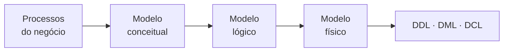
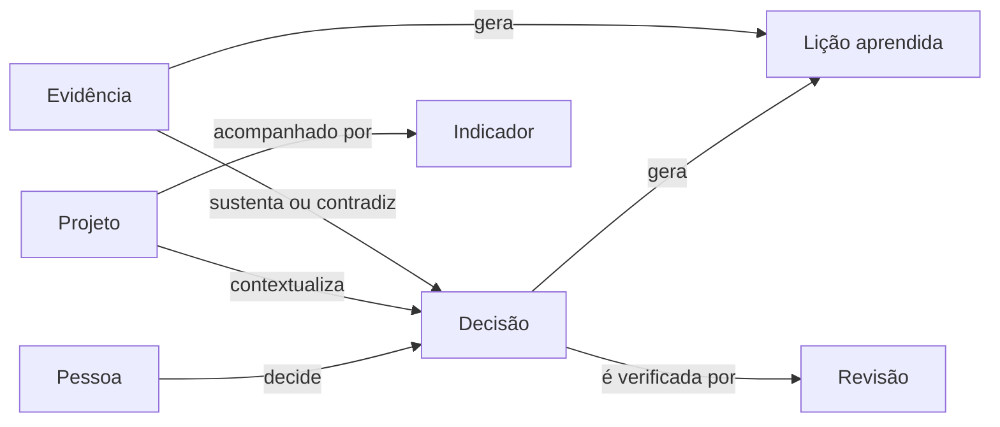
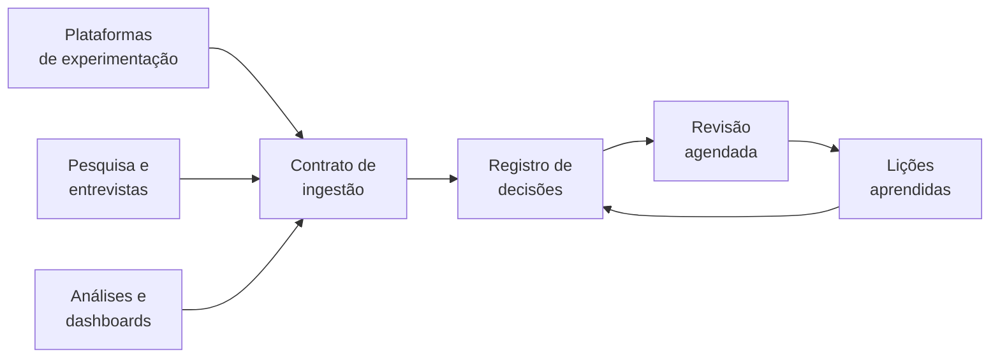

# Memória Organizacional para Apoio à Tomada de Decisão

## Documento de Concepção

Versão 0.1 · 21 de setembro de 2026

## Motivação

Organizações decidem o tempo todo e guardam quase nada do raciocínio por trás de cada decisão. O que sobrevive é o *o quê* — a escolha registrada em ata, ticket ou slide. O que evapora é o *porquê*: o contexto da época, as alternativas descartadas, a evidência considerada e o que se esperava que acontecesse.

A consequência é cara e silenciosa. A mesma questão é redecidida a cada dois anos por pessoas diferentes, com o mesmo custo de análise. Erros se repetem porque a lição ficou na cabeça de quem saiu. E ninguém consegue responder à pergunta mais básica de aprendizado organizacional: *nós costumamos acertar?*

O problema não é falta de ferramenta. É que o registro de decisão compete com o trabalho de decidir. Quem acabou de fechar uma escolha difícil não quer abrir um formulário; e um repositório que ninguém consulta não gera incentivo para ninguém alimentar. Todo sistema desse tipo morre nesse laço.

Este documento propõe um sistema de memória organizacional desenhado em torno desse laço, e não apesar dele: custo de escrita próximo de zero, consulta no momento em que a decisão está sendo tomada, e revisão agendada do desfecho.

## Problema

O conhecimento decisório de uma organização se perde por quatro mecanismos distintos, e cada um exige um tratamento diferente.

| Sintoma | Mecanismo | Custo |
| --- | --- | --- |
| "Já testamos isso?" sem ninguém saber responder | Resultado registrado na ferramenta de origem, não no corpo de conhecimento | Retrabalho e experimento duplicado |
| Decisão reaberta anos depois do zero | O *porquê* e as alternativas descartadas não foram registrados | Custo de análise pago duas vezes |
| Lição aprendida presa em uma pessoa | Aprendizado não foi destacado da decisão que o originou | Perda total na saída do profissional |
| Ninguém sabe se o time decide bem | Expectativa não foi registrada antes do desfecho | Impossível calibrar ou melhorar o processo |

Os dois primeiros são problemas de **captura**. Os dois últimos são problemas de **modelo**: mesmo organizações que registram decisões costumam guardar apenas a escolha e o resultado, sem separar a lição como objeto próprio e sem congelar a expectativa antes do fato.

O quarto sintoma é o mais grave e o menos percebido. Quando o campo de resultado fica no mesmo registro da decisão, ele é preenchido *depois* que o desfecho é conhecido. Isso destrói o único dado que permitiria medir a qualidade decisória ao longo do tempo: o que se acreditava antes de saber.

Um quinto fator atravessa todos: evidência heterogênea não conversa. Um experimento A/B vive na plataforma de experimentação, três entrevistas vivem no repositório de pesquisa, uma análise de coorte vive num dashboard. A decisão que pesou os três não tem onde registrar esse peso.

## Objetivo, escopo e não-escopo

O sistema é um **registro de decisões e aprendizagens** que consolida evidência de origens heterogêneas e cobra a revisão do desfecho.

**Está no escopo:**

- Registrar a decisão com contexto, alternativas descartadas, responsável e expectativa mensurável
- Referenciar evidência de qualquer origem — experimento, pesquisa, análise, documento — sem copiá-la
- Destacar a lição aprendida como entidade própria, reutilizável entre decisões e projetos
- Agendar e cobrar a revisão do desfecho, alimentando uma medida de calibração
- Ingerir resultados de plataformas de experimentação por contrato aberto, sem acoplamento a fornecedor
- Ser consultável no fluxo de trabalho, incluindo por agentes

**Está fora do escopo:**

- Executar, orquestrar ou analisar experimentos — o sistema é consumidor de resultado, nunca produtor
- Substituir repositório de pesquisa, ferramenta de analytics ou gestor de documentos
- Escrever de volta em qualquer sistema de origem
- Ser uma camada universal de abstração estatística entre plataformas de experimentação

A última exclusão é a mais importante e será justificada na seção de arquitetura. Tentar tornar efeitos comparáveis entre plataformas com motores estatísticos diferentes é um problema sem solução correta, e a tentativa costuma consumir o projeto inteiro.

## Estado da arte

Existem ferramentas maduras para cada tipo de evidência isolado, e nenhuma para a decisão que as atravessa.

| Categoria | Exemplos | O que cobre | O que não cobre |
| --- | --- | --- | --- |
| Decisão corporativa | Cloverpop, Loomio | Registro e deliberação de decisão | Evidência quantitativa estruturada |
| Decisão técnica (ADR) | Log4brains, adr-tools, Loqbooq | Decisão de arquitetura versionada com o código | Decisão de produto e evidência externa |
| Análise multicritério | 1000minds, TransparentChoice, Decision Lens | Escolha estruturada com pesos explícitos | Memória e revisão de desfecho |
| Experimentação | [GrowthBook](https://docs.growthbook.io/insights), ABsmartly, Statsig, Eppo | Resultado estatístico e, no caso do GrowthBook, base de aprendizados | Evidência qualitativa |
| Pesquisa qualitativa | Dovetail, Condens, Marvin | Entrevistas, temas, evidência citável | Resultado de experimento |
| Discovery de produto | Jira Product Discovery, Productboard | Ideias, insights anexados, priorização | Expectativa registrada e revisão de desfecho |

O movimento mais relevante do último ano vem da própria camada de experimentação. O GrowthBook lançou uma seção Insights com uma página de **Learnings** — base de conhecimento pesquisável de todos os experimentos concluídos — além de Experiment Timeline e Metric Effects ([docs](https://docs.growthbook.io/insights), [anúncio](https://www.growthbook.io/blog/introducing-learnings)). A plataforma também importa experimentos executados por sistemas de bucketing próprios, varrendo o data source em busca de ids novos ([docs](https://docs.growthbook.io/using/experimenting)).

A leitura correta desse movimento é que **consolidar e buscar experimentos dentro do domínio de experimentação está sendo comoditizado**. Reconstruir essa capacidade seria competir de frente com quem já a tem.

A lacuna que permanece vazia é a camada acima: o registro que pesa um experimento, três entrevistas e uma análise de coorte numa mesma escolha, guarda a expectativa antes do desfecho e cobra a revisão. Nenhuma das categorias acima faz isso, e as razões são estruturais — plataformas de experimentação não guardam transcrição de entrevista, e repositórios de pesquisa não guardam intervalo de confiança.

Existe ainda um conjunto emergente de servidores MCP de decision log voltados a agentes de código, com escopo local, monousuário e restrito a decisões técnicas. Eles validam a interface, mas não o recorte.

## Modelo conceitual de negócio

O modelo de dados é derivado do negócio, não desenhado a partir das tabelas. Cinco camadas antecedem qualquer entidade.

1. **Gestão do negócio** — o que a organização entrega e quais decisões alteram esse resultado. Define quais decisões merecem registro; registrar tudo equivale a registrar nada.
2. **Gestão dos processos** — onde, dentro do fluxo de trabalho, a decisão é efetivamente tomada. Determina o ponto de captura e é o que faz o custo de escrita cair.
3. **Gestão de projetos** — o recorte organizacional das decisões, seus responsáveis e seus indicadores de desempenho.
4. **Visão do sistema** — atores, casos de uso e fronteiras, em UML. Quem escreve, quem consulta, quem revisa.
5. **Leis, regras e POP** — restrições que o modelo precisa honrar: LGPD, sigilo comercial, política de retenção e alçada decisória.

A camada 5 tem consequência direta no schema. Um registro de decisão guarda pessoa identificada, cargo e vínculo organizacional, e por isso é base de dados pessoais. Atributos sem função decisória — faixa salarial, telefone pessoal — não devem entrar por conveniência de modelagem.

Requisitos, restrições e mecanismos são os três insumos que traduzem os processos do negócio em modelo lógico. O percurso completo:



O modelo conceitual responde *o que existe*; o lógico, *como se relaciona e normaliza*; o físico, *como é implementado*. Este documento cobre os dois primeiros; a implementação de referência do terceiro está em [`db/schema.sql`](../db/schema.sql).

**Leitura VSM.** Pelo Modelo de Sistema Viável de Stafford Beer, memória organizacional não pertence à operação. Ela serve o Sistema 4 — inteligência, que olha ambiente e futuro — alimentado pelo Sistema 3\*, o canal de auditoria que verifica esporadicamente o que a operação de fato produziu. O loop de revisão de desfecho proposto aqui é exatamente um mecanismo de 3\*: uma checagem agendada e independente do relato corrente. Sem ele, o sistema vira arquivo, não inteligência.

## Modelo conceitual de dados

Sete entidades centrais sustentam o domínio. Três delas — Evidência, Lição e Revisão — são o que separa este modelo de um log de decisões comum.

| Entidade | O que é | Por que existe separada |
| --- | --- | --- |
| Decisão | A escolha registrada, com contexto e alternativas descartadas | Núcleo do domínio |
| Pessoa | O indivíduo; "decisor" é um papel que ela exerce numa decisão | A mesma pessoa é decisor, autor de documento e gestor de área |
| Projeto | Recorte organizacional do trabalho | Agrupa decisões e indicadores |
| Evidência | Qualquer insumo consultado: experimento, pesquisa, análise, documento | Polimórfica: só assim experimento e entrevista convivem |
| Lição aprendida | Afirmação reutilizável destilada de uma decisão ou experimento | Sobrevive à decisão que a originou e viaja entre projetos |
| Revisão | Verificação agendada do desfecho de uma decisão | Uma decisão pode ser revista mais de uma vez |
| Indicador | Métrica de acompanhamento de um projeto | Medido periodicamente, não uma vez |

O desenho das relações:



Quatro decisões de modelagem carregam a maior parte do valor do sistema.

**Evidência é polimórfica, não é documento.** Um documento tem título e URL. Um experimento tem hipótese, variantes, efeito, método estatístico e identificador na plataforma de origem. Tratar experimento como "documento tipo experimento" descarta tudo o que torna a consulta útil.

**A relação Decisão–Evidência carrega atributos.** Não basta saber que a evidência foi referenciada: importa *como* foi usada — se sustentou, contradisse ou foi explicitamente descartada — e qual a força daquela evidência. Isso é propriedade da aresta, não da evidência.

**Expectativa e desfecho não podem coabitar.** O grau de confiança e o resultado esperado são registrados no ato da decisão; o desfecho chega meses depois. Se ficarem no mesmo registro, o segundo sobrescreve o primeiro e a única medida possível de qualidade decisória desaparece.

**O vínculo organizacional é temporal.** Cargo e área precisam refletir a situação *na data da decisão*, não a atual. Uma memória organizacional que mostra um coordenador de 2023 como diretor de 2026 não responde à pergunta que justifica sua existência.

## Modelagem lógica: dicionário e normalização

Esta seção registra a modelagem como executada, partindo do enunciado em linguagem natural até a terceira forma normal. A revisão crítica dela vem na seção seguinte.

### Enunciado

A empresa organiza o trabalho em projetos. Ao longo de cada projeto, decisores tomam decisões relevantes que precisam ficar registradas para consulta futura. Cada decisão está vinculada a exatamente um projeto e é de responsabilidade de um único decisor, mas um decisor pode tomar várias decisões, em projetos diferentes.

Toda decisão pode referenciar um ou mais documentos de apoio — atas, e-mails, relatórios, pareceres — e um mesmo documento pode ser referenciado por mais de uma decisão. De cada decisão podem se originar uma ou mais lições aprendidas, e uma mesma lição pode estar associada a decisões semelhantes tomadas em projetos diferentes.

Cada projeto possui um ou mais indicadores de desempenho, medidos periodicamente. Cada decisor pertence a uma área e ocupa um cargo, sendo que cargo e área podem ser compartilhados por vários decisores.

### Substantivos e verbos refinados

Substantivos: Decisor, Decisão, Projeto, Documento, Lição Aprendida, Indicador, Área, Cargo.

Verbos: registra, organiza, toma, vincula, referencia, gera, mede, pertence, ocupa.

### Dicionário de dados

```
DECISAO         = {cod_decisao + data_decisao + descricao + resultado +
                   matricula_decisor + nome_decisor + cargo_decisor + area_decisor +
                   cod_projeto + nome_projeto + data_inicio_projeto + data_fim_projeto +
                   documentos_referenciados (cod_documento + tipo_documento +
                                             titulo_documento + url_documento) +
                   licoes_geradas (cod_licao + resumo_licao + tags_licao +
                                   data_registro_licao)}
DECISOR         = {matricula_decisor + nome_decisor + cargo + area + email + telefone}
PROJETO         = {cod_projeto + nome_projeto + data_inicio + data_fim + status +
                   indicadores (cod_indicador + nome_indicador + valor_indicador +
                                periodo_indicador)}
DOCUMENTO       = {cod_documento + tipo_documento + titulo_documento + url_documento}
LICAO_APRENDIDA = {cod_licao + resumo_licao + tags_licao + data_registro_licao}
```

### Após 1FN — eliminação de grupos repetitivos

```
DECISAO           = {cod_decisao + data_decisao + descricao + resultado +
                     matricula_decisor + nome_decisor + cargo_decisor + area_decisor +
                     cod_projeto + nome_projeto + data_inicio_projeto + data_fim_projeto}
DOCUMENTO         = {cod_documento + tipo_documento + titulo_documento + url_documento}
DECISAO_DOCUMENTO = {cod_decisao + cod_documento}
LICAO_APRENDIDA   = {cod_licao + resumo_licao + tags_licao + data_registro_licao}
DECISAO_LICAO     = {cod_decisao + cod_licao}
PROJETO           = {cod_projeto + nome_projeto + data_inicio + data_fim + status}
INDICADOR         = {cod_indicador + cod_projeto + nome_indicador + valor_indicador +
                     periodo_indicador}
DECISOR           = {matricula_decisor + nome_decisor + cargo + area + email + telefone}
```

### Após 2FN e 3FN

```
DECISOR           = {MATRICULA_DECISOR + nome_decisor + email + telefone +
                     cod_cargo + cod_area}
CARGO             = {COD_CARGO + nome_cargo + faixa_salarial}
AREA              = {COD_AREA + nome_area + gestor_responsavel}
PROJETO           = {COD_PROJETO + nome_projeto + data_inicio + data_fim + status}
DECISAO           = {COD_DECISAO + data_decisao + descricao + resultado +
                     matricula_decisor + cod_projeto}
INDICADOR         = {COD_INDICADOR + cod_projeto + nome_indicador + valor_indicador +
                     periodo_indicador}
DOCUMENTO         = {COD_DOCUMENTO + tipo_documento + titulo_documento + url_documento}
DECISAO_DOCUMENTO = {cod_decisao + cod_documento}
LICAO_APRENDIDA   = {COD_LICAO + resumo_licao + tags_licao + data_registro_licao}
DECISAO_LICAO     = {cod_decisao + cod_licao}
```

O acerto mais sutil desta modelagem é `DECISAO_LICAO` como N:N. É o que permite a mesma lição ser associada a decisões semelhantes em projetos diferentes, transformando a lição em ativo reutilizável em vez de nota de rodapé de uma decisão.

## Revisão crítica do modelo

Oito achados, entre erros formais de normalização e limitações de modelagem que comprometem o propósito do sistema.

| # | Achado | Tipo | Correção |
| --- | --- | --- | --- |
| 1 | `tags_licao` permanece multivalorado | 1FN não fechada | Extrair `TAG` e `LICAO_TAG` |
| 2 | O passo rotulado 2FN é, de fato, 3FN | Rótulo incorreto | Renomear; chave simples não admite dependência parcial |
| 3 | `INDICADOR` mistura indicador e medição | 2FN violada, não tratada | Separar `INDICADOR` e `MEDICAO` |
| 4 | `AREA.gestor_responsavel` é texto livre | Referência não normalizada | FK para a pessoa |
| 5 | Cargo e área não são temporais | Limitação de propósito | Snapshot na decisão ou tabela de lotação |
| 6 | `resultado` no mesmo registro da decisão | Perda de dado | Relação própria, append-only |
| 7 | `faixa_salarial` fora de escopo | LGPD e escopo | Remover do modelo |
| 8 | `matricula` como chave primária | Chave natural instável | Chave substituta |

### Os três erros formais

**A 1FN não fechou.** O atributo `tags_licao` atravessa o dicionário e as três formas normais como campo plural. Os grupos repetitivos de documentos e lições foram corretamente decompostos, mas as tags passaram. A correção é direta:

```
TAG       = {COD_TAG + nome_tag}
LICAO_TAG = {cod_licao + cod_tag}
```

Ela importa mais do que parece: a taxonomia compartilhada é o mecanismo que permite cruzar evidência de origens diferentes. Sem tags relacionais, não há consulta transversal.

**Os rótulos de 2FN e 3FN estão trocados.** `DECISAO` tem chave primária simples, e com chave simples não existe dependência parcial — a relação já está em 2FN por construção. Os atributos removidos naquele passo (`nome_decisor`, `cargo_decisor`, `nome_projeto`, `data_inicio_projeto`) são dependências **transitivas** via `matricula_decisor` e `cod_projeto`. Os dois passos são, portanto, 3FN.

**A única violação real de 2FN ficou sem tratamento.** Se os indicadores são medidos periodicamente, a chave de `INDICADOR` é composta — `(cod_indicador, periodo)` — e `nome_indicador` depende apenas de `cod_indicador`. Dependência parcial clássica:

```
INDICADOR = {COD_INDICADOR + cod_projeto + nome_indicador + unidade + direcao}
MEDICAO   = {COD_INDICADOR + PERIODO + valor}
```

Como estava, ou se guardava um único valor por indicador — contrariando o enunciado — ou se repetia `nome_indicador` a cada medição.

### A limitação que mais compromete o propósito

Cargo e área residem em `DECISOR`, o que significa que o modelo guarda o vínculo **atual** da pessoa, não o vínculo na data da decisão. Em três anos, uma decisão tomada por um coordenador aparecerá como decisão de um diretor, e a pergunta "quem tinha alçada para decidir isso, naquele momento?" fica sem resposta.

Duas correções possíveis, em ordem crescente de rigor:

```
-- snapshot na própria decisão
DECISAO += {cod_cargo_na_data + cod_area_na_data}

-- histórico de lotação com vigência
LOTACAO = {MATRICULA + COD_CARGO + COD_AREA + inicio_vigencia + fim_vigencia}
```

O mesmo raciocínio se aplica a `resultado`. Como campo sobrescrevível dentro de `DECISAO`, ele é preenchido depois que o desfecho é conhecido, apagando o que se acreditava antes. Precisa migrar para uma relação própria com carimbo de tempo e escrita apenas por inserção.

## Modelo lógico consolidado

O conjunto abaixo aplica as oito correções e acrescenta as relações exigidas pelo escopo de produto. Chaves primárias em maiúsculas. A implementação de referência em PostgreSQL, com identificadores em inglês e testes das invariantes, está em [`db/schema.sql`](../db/schema.sql).

```
-- Pessoas e vínculo organizacional
PESSOA            = {ID_PESSOA + nome + email}
CARGO             = {COD_CARGO + nome_cargo}
AREA              = {COD_AREA + nome_area + id_pessoa_gestor}
LOTACAO           = {ID_PESSOA + COD_CARGO + COD_AREA + INICIO_VIGENCIA + fim_vigencia}

-- Contexto organizacional
PROJETO           = {COD_PROJETO + nome_projeto + data_inicio + data_fim + status}
INDICADOR         = {COD_INDICADOR + cod_projeto + nome_indicador + unidade + direcao}
MEDICAO           = {COD_INDICADOR + PERIODO + valor}

-- Decisão
DECISAO           = {COD_DECISAO + data_decisao + titulo + contexto + descricao +
                     tipo_porta + id_pessoa_decisor + cod_projeto +
                     cod_cargo_na_data + cod_area_na_data}
ALTERNATIVA       = {COD_ALTERNATIVA + cod_decisao + descricao + motivo_descarte}
EXPECTATIVA       = {COD_DECISAO + REGISTRADO_EM + confianca + metrica_esperada +
                     magnitude_esperada + prazo}
REVISAO           = {COD_REVISAO + cod_decisao + data_prevista + data_realizada +
                     veredito + observacao}

-- Evidência
EVIDENCIA         = {COD_EVIDENCIA + tipo + titulo + url + origem_sistema +
                     id_externo + forca + payload_bruto}
DECISAO_EVIDENCIA = {COD_DECISAO + COD_EVIDENCIA + papel + peso}

-- Aprendizado
LICAO             = {COD_LICAO + resumo + data_registro + estado}
DECISAO_LICAO     = {COD_DECISAO + COD_LICAO}
EVIDENCIA_LICAO   = {COD_EVIDENCIA + COD_LICAO}

-- Taxonomia
TAG               = {COD_TAG + nome_tag}
DECISAO_TAG       = {COD_DECISAO + COD_TAG}
EVIDENCIA_TAG     = {COD_EVIDENCIA + COD_TAG}
LICAO_TAG         = {COD_LICAO + COD_TAG}

-- Governança do registro
PROCEDENCIA       = {COD_PROCEDENCIA + objeto_tipo + objeto_id + autor_tipo + modelo +
                     referencia_origem + atestado_por + atestado_em + estado}
```

Seis observações sobre o conjunto:

- `EXPECTATIVA` tem chave composta com `REGISTRADO_EM` e escrita apenas por inserção. Revisões da expectativa acumulam; nada é sobrescrito.
- `EVIDENCIA` carrega chave única `(origem_sistema, id_externo)`. É o que torna a reimportação idempotente.
- `payload_bruto` guarda a resposta original da plataforma de origem. Quando a normalização se revelar errada — e ela vai — o dado ainda está lá.
- `forca` classifica a evidência em causal, correlacional ou anedótica, para que três entrevistas não pesem como um experimento controlado.
- `papel` em `DECISAO_EVIDENCIA` registra se a evidência sustentou, contradisse ou foi descartada. Evidência contrária registrada é o que distingue memória de justificativa.
- `PROCEDENCIA` é transversal e responde quem escreveu cada registro — pessoa ou agente — e quem o atestou.

## Arquitetura de integração

O sistema é contract-first: publica um contrato de ingestão e implementa adapters como cortesia, nunca como interface primária. A diferença é decisiva para a manutenção — no modelo adapter-first, o projeto é dono de N integrações e quebra a cada mudança de API de terceiro. Ver [ADR 0001](adr/0001-contract-first.md).



### Três modos de ingestão

| Modo | Como funciona | Público principal |
| --- | --- | --- |
| Push | JSON Schema versionado + endpoint idempotente | Plataforma de experimentação interna |
| Warehouse | Pacote dbt com contrato de colunas sobre uma view | Quem já grava resultados no data warehouse |
| Pull | Adapter contra a API do fornecedor | GrowthBook e ABsmartly, no máximo |

O modo push é canônico: todo adapter oficial deve ser implementado sobre ele, sem caminho privilegiado. Se o adapter próprio precisar de atalho interno, o contrato está mal desenhado.

O modo warehouse tende a ser o de menor atrito para plataformas internas, que já materializam resultados em tabela. Não exige código de aplicação nem credencial nova, e o backfill histórico sai na primeira execução.

### Níveis de conformidade

A degradação graciosa é o que torna o contrato adotável. Uma fonte que só consegue enviar o nível mínimo já entrega valor. Especificação completa em [`spec/`](../spec/).

| Nível | Campos | O que habilita |
| --- | --- | --- |
| L0 | origem, id externo, nome, data de início, variantes | Busca e resposta a "isso já foi testado?" |
| L1 | + hipótese, responsável, desfecho, tags, aprendizado | Corpo de conhecimento consultável |
| L2 | + métrica primária, efeito com intervalo, método, segmentos | Meta-análise dentro de uma mesma fonte |

Apenas os campos de L0 são obrigatórios.

### Normalizar a afirmação, não a estimativa

Esta é a restrição central da integração, registrada no [ADR 0003](adr/0003-normalizar-afirmacao.md). Plataformas de experimentação usam motores estatísticos distintos — bayesiano ou frequentista, com ou sem CUPED, com ou sem teste sequencial — e definições de lift e de métrica que variam por empresa. Um efeito de 3% medido em duas plataformas não é a mesma grandeza.

A consequência de projeto: normalizar metadado e conclusão, jamais tornar efeitos comparáveis entre fontes. O campo de efeito é armazenado com seu método declarado e marcado explicitamente como não comparável fora da própria origem. Tentar resolver esse problema é o caminho mais curto para consumir o projeto inteiro em um trabalho sem resposta correta.

### Princípios invioláveis

- **Somente leitura.** O sistema nunca escreve de volta em fonte alguma. No instante em que virar caminho de escrita, passa a ser dependência crítica de produção e deixa de ser instalável. Ver [ADR 0004](adr/0004-somente-leitura.md).
- **Idempotência.** Chave natural `(origem_sistema, id_externo)` com upsert. Plataformas internas reprocessam o histórico várias vezes até acertar o mapeamento.
- **Backfill como caso primário.** A primeira carga é o momento da verdade; o fluxo incremental é secundário.
- **Escape hatch obrigatório.** Tipo de experimento livre, campo de extensões e payload bruto. Holdouts, camadas mutuamente exclusivas e switchback existem, e a postura correta é tolerar não modelá-los.

## Interface MCP-first

A interface primária do sistema é um servidor MCP, não uma aplicação web. A escolha ataca diretamente o mecanismo que mata registros de decisão: o custo de escrita. Ver [ADR 0002](adr/0002-mcp-first.md) e a especificação em [`MCP_TOOLS.md`](../MCP_TOOLS.md).

Se a interface é MCP, quem escreve o registro é o agente que já está redigindo o documento de proposta, já está no pull request, já está resumindo a reunião. A pessoa não troca de contexto. E a consulta — "o que já sabemos sobre isso?" — acontece no momento em que a decisão está sendo formada, não quando alguém lembra de pesquisar.

Como efeito secundário, o escopo inicial cai pela metade: não há frontend a construir no primeiro ciclo.

### Superfície de ferramentas

Seis, no máximo, na concepção; o [ADR 0006](adr/0006-linha-do-tempo-e-relacionadas.md) subiu para oito. A descrição de cada uma é parte do produto, não documentação acessória — é ela que determina se o agente chama a ferramenta no momento certo.

| Ferramenta | Função |
| --- | --- |
| `search_evidence` | Busca no corpo de conhecimento; a mais importante |
| `get_decision` | Recupera uma decisão e suas evidências |
| `propose_decision` | Cria um registro em estado proposto |
| `attach_evidence` | Vincula evidência a uma decisão, com papel e peso |
| `record_learning` | Registra lição de experimento ou de revisão |
| `list_pending_reviews` | Revisões vencidas; alimenta o lembrete embutido |
| `get_topic_timeline` | Trajetória de um tema em ordem cronológica ([ADR 0006](adr/0006-linha-do-tempo-e-relacionadas.md)) |
| `find_related` | Decisões que compartilham evidência, lição ou tag com uma decisão ([ADR 0006](adr/0006-linha-do-tempo-e-relacionadas.md)) |

### O risco central: a invocação não é controlada

O servidor pode estar correto e o agente simplesmente não chamar `search_evidence` antes de redigir a proposta, porque quem controla o prompt do sistema é o cliente, não o servidor. Três mitigações, em ordem de eficácia:

1. **Lembretes embutidos na resposta das ferramentas.** Toda resposta de escrita devolve o que falta fechar; toda resposta de leitura devolve revisões pendentes relacionadas. Implementações públicas desse padrão relatam salto expressivo na taxa de fechamento do loop — e ainda assim uma maioria dos loops continua vazando, o que confirma que a camada assíncrona de cobrança é indispensável.
2. **Distribuir servidor e skill como unidade.** A regra "antes de redigir a proposta, consulte o repositório" mora na skill, não no servidor. Servidor MCP distribuído sozinho é chamado por acidente.
3. **Descrições escritas como gatilho**, não como manual.

### Procedência e atestação

Agente escrevendo em sistema de registro cria um risco novo: aprendizado plausível que ninguém verificou. Duas regras inegociáveis.

**Estado explícito.** Registro criado por agente entra como proposto e só se torna atestado com identidade humana associada. A atestação pode ser um clique, mas precisa existir.

**Expectativa nunca é gerada por agente.** Se o agente estimar a confiança, a curva de calibração vira ruído e o sistema perde a única medida que justifica sua existência no longo prazo. Esse campo é digitado por pessoa ou fica nulo.

### Dois limites conhecidos

O agente pode atravessar servidores MCP e funcionar como camada de integração oportunista, lendo de uma plataforma e escrevendo aqui. Mas **o agente não pode ser o mecanismo de sincronização do registro**: é não determinístico e não auditável. MCP serve o caminho humano em fluxo; o pipeline determinístico serve a completude.

E os perfis que produzem metade da evidência — gestão de produto e pesquisa — não trabalham em clientes de agente de código. Para eles a superfície é Slack, sobre o mesmo backend. Tratar MCP como interface única significaria perder exatamente a evidência qualitativa que diferencia o sistema.

## Riscos e critérios de sucesso

| Risco | Por que acontece | Mitigação |
| --- | --- | --- |
| Repositório que ninguém consulta | Caminho de leitura tratado como secundário | Construir busca e consulta em fluxo antes de qualquer tela de cadastro |
| Custo de escrita alto demais | Formulário como interface de entrada | Importação preenche tudo; resta um parágrafo humano |
| Loop de revisão não fecha | MCP é pull; ninguém é cobrado | Camada assíncrona de cobrança com data agendada |
| Deriva de taxonomia | Tags livres sem governança | Conjunto curado, revisão periódica, fusão de sinônimos |
| Registro poluído por agente | Escrita automática sem verificação | Estado proposto e atestação humana obrigatória |
| Manutenção de adapters | Cada API de terceiro muda | No máximo dois adapters próprios; resto via contrato |
| Escopo capturado pela estatística | Tentativa de comparar efeitos entre plataformas | Normalizar afirmação, nunca estimativa |
| Evidência qualitativa não entra | Não há automação possível para entrevista | Superfície em Slack e extração assistida com revisão humana |

Os dois primeiros riscos concentram a maior parte da mortalidade histórica desse tipo de sistema. Os demais degradam o produto; esses dois o matam.

### Critérios de sucesso

O teste que importa não é de adoção declarada, e sim de consulta espontânea.

- **Dois meses após o piloto interno**, alguém consulta o repositório sem ser solicitado, antes de iniciar uma iniciativa. Se isso não ocorrer, o problema não era ferramenta.
- **Um exportador de plataforma interna cabe em uma tarde de trabalho.** É o teste objetivo da qualidade do contrato de ingestão.
- **A taxa de revisões fechadas no prazo sobe ao longo do tempo.** É o indicador de que o loop funciona.
- **Existe curva de calibração mensurável** ao fim do primeiro ano, ou seja, houve expectativa registrada antes do desfecho em volume suficiente.

## Próximos passos

A ordem é deliberada: o contrato antes do código, e o caminho de leitura antes do de escrita.

- [x] Publicar `experiment-record-v0.schema.json` com os três níveis de conformidade, sem aplicação em volta
- [ ] Validar o contrato com duas equipes que operam plataforma de experimentação interna — critério: o exportador cabe em uma tarde
- [ ] Publicar o contrato de colunas da view de warehouse e o pacote dbt correspondente
- [x] Escrever `MCP_TOOLS.md`: as seis ferramentas com assinatura, descrição-gatilho, formato do lembrete embutido e a máquina de estados proposto → atestado → revisado
- [ ] Testar a invocação das ferramentas em cliente real, antes de existir backend
- [x] Implementar o modelo lógico consolidado em Postgres, com índices de busca textual
- [ ] Construir o adapter do GrowthBook sobre o modo push, sem caminho privilegiado
- [ ] Implementar a camada assíncrona de cobrança de revisão
- [ ] Piloto interno de dois meses com medição de consulta espontânea

Decisões ainda em aberto, a resolver antes da implementação:

- Licenciamento: MIT integral ou open core com módulos corporativos separados
- Modelo de identidade e permissão: por projeto, por área, ou aberto por padrão dentro da organização
- Se a superfície de Slack entra no primeiro ciclo ou no segundo

## Referências

Páginas consultadas:

- [Insights — GrowthBook Docs](https://docs.growthbook.io/insights) — páginas de Dashboard, Learnings, Experiment Timeline, Scaled Impact e Metric Effects
- [GrowthBook Learnings turn experiments into knowledge](https://www.growthbook.io/blog/introducing-learnings) — racional do produto e a dependência de boa documentação de experimento
- [GrowthBook launch month — Week 2](https://www.growthbook.io/blog/growthbook-launch-month-week-2) — descrição da página de Learnings como base de conhecimento pesquisável
- [Experimenting in GrowthBook](https://docs.growthbook.io/using/experimenting) — importação de experimentos a partir do data source
- [Experimentation Insights](https://www.growthbook.io/products/insights) — posicionamento da biblioteca de aprendizados

As demais ferramentas citadas na seção de estado da arte — Cloverpop, Loomio, Dovetail, Jira Product Discovery, Productboard, ABsmartly, Statsig, Eppo, 1000minds, TransparentChoice, Decision Lens, Log4brains, Loqbooq — aparecem por conhecimento geral e devem ser verificadas em fonte primária antes de qualquer citação formal.

Referências conceituais a completar com edição e página antes de uso acadêmico:

- Beer, S. *Brain of the Firm* e *The Heart of Enterprise* — Modelo de Sistema Viável, sistemas 3\*, 4 e 5
- Framework ISA (Investigation / Study / Assay) — modelagem de metadado de experimento em ciências da vida, prior art para o contrato de ingestão
- OpenFeature — padrão aberto de avaliação de feature flags; cobre a leitura da flag, não o resultado nem o aprendizado
- OpenTelemetry — modelo de convenções semânticas mais collector com receivers por fornecedor, referência de arquitetura para o contrato
